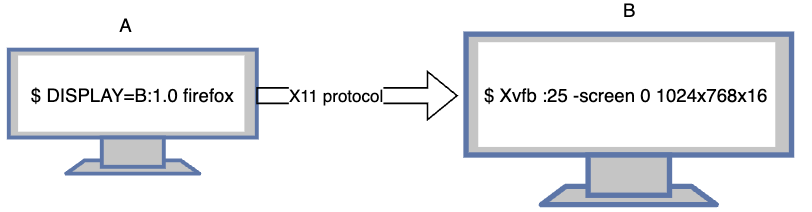

## X11 Window System

### X11

X11 是一个协议，它规定了 Xserver 和 Xclient 的通信方式，给 GUI 程序提供了显示器，显卡，键盘，鼠标， 设备的能力

### Xclient

Xclient 是能够使用 X11 协议和 Xserver 通信的程序，比如常见的所有 Linux 上的 GUI 程序，firefox, chrome等。

### Xserver

Xserver 是实现了 X11 服务端协议的进程，比如 Xorg、Xvbf. 程序， 它负责维护一个  Display (显示器 + 鼠标 + 键盘 + 显卡)， 运行 Xclient 程序使用这个 Display。 Xserver将自己维护的 Display 包装成服务提供给 Xclient 程序使用，他是Server端。 即是 Server端， 就可以允许任意设备的程序来连接它， 使他提供显示服务。 比如在 A 电脑运行 firefox 进程， 可以连接到 B 电脑的 Xserver, 从而实现 A 将应用启动到 B 上。

### X11 协议示列图

图上显示在 A 电脑上启动 firefox `Xclient`程序，其界面显示在 B `Xserver`电脑上。这里用两台电脑做演示是为了让你体会 程序的界面和程序的执行是独立的，当 A,B 合二为一的时候，原理不变。



上述例子中，A电脑提供了 firefox 程序所需要的 CPU, 内存等资源，B 电脑提供了 firefox 程序界面需要的显示服务，包括显示器，键盘，鼠标。

## 手动启动 Xserver

手动启动 Xserver 方式有很多，我介绍常用的 3 种启动 Xserver 的方式。

> 1.手动最直接启动 Xserver 的方法是直接使用 `X` 命令，下面是两个例子: 

```shell
# 在 25 号本地 display 中启动 X， 显示在 vt8 中。 这样可以在非 ssh 的情况下，使用快捷键 ctrl + alt + f8 切换到 vt8 中显示当前 Xserver
X :25 vt8

# 2.在 25 号本地 display 中启动X
X :25
```

> 2.通过 tigervnc 的 `Xvnc` 命令启动 Xserver

```shell
# 在25号本地 display 启动分辨率为 1024 x 768，色深度 16 的 Xserver， 并且监听一个 4025 没有认证的 vnc server 
Xvnc :25 -rfbport 4025 -SecurityTypes None -geometry 1024x768 -depth 16
```

> 3.使用 `Xvbf`  命令启动一个虚拟帧缓冲区

```shell
# 在本地 display 启动分辨率为 1024 x 768，色深度 16 的 Xserver
Xvfb :25 -screen 0 1024x768x16 
```

==注意: 上述命令启动 Xserver 后，不能直接像X11 协议示列图中，将A 的firefox启动到 B 中的Xserver中，只允许本地的 Xclient传输到 Xserver中==

## 启动Xclient 到 Xserver 中

### 映射到本地的 Xserver中

```shell
DISPLAY=:25 firefox
```

### 映射到远程远程的 Xserver中

```shell
DISPLAY={remote ip address}:25.0 firefox
```

## 查看 Xserver 中的内容

1.若你使用 X :25 vt8 并且没有使用 ssh 命令进行连接， 可以直接使用快捷键 `ctrl + alt + f8` 切换到vt8进行显示

2.若你使用 X :25 命令， 并且使用了 ssh 进行远程，那么你需要启动一个 x11vnc 服务， 这样你就可以使用 vncewer 进行查看

```shell
x11vnc -display :25 -nopw -listen localhost -xkb
```

3.通过 tigervnc 的 xvnc 启动的 Xserver 启动 xserver, 可以直接使用 vncviewer 连接4025 端口既可以查看
