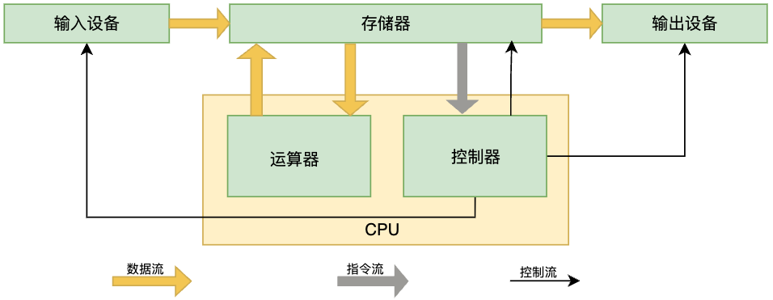
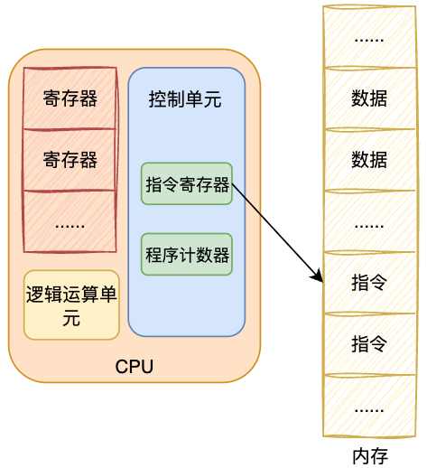

## 图灵机的工作方式

图灵机的基本组成

有一条 [纸带]， 自带有一个个连续的格子组成，每个格子可以写入字符，字带好比内存，而纸带上的格子的字符就好比内存中存储的数据或者程序；

有一个 [读写头]， 读写头可以读取纸带上人意格子的字符， 也可以把字符写入到纸带的格子

速写头上有一些部件，比如存储单元，控制单元以及运算单元：1、存储单元用来存放数据；2、控制单元用于识别字符是数据还是指令，以及控制程序的流程等； 3、运算单元用于执行运算指令；

## 冯诺伊曼模型

在1945年冯诺伊曼和其他计算机科学家们提出了计算机具体实现的报告，其遵循了图灵机的设计，而且还提出用电子元件构造计算机，并约定了用二进制进行计算和存储

冯诺伊曼计算机基本结构分为5个部分，分别是运算器、控制器、存储器、输入设备、输出设备，这5个部分也被称为称为冯诺伊曼模型。

运算器、控制器是在中央处理器里的，存储器就我们常见的内存，输入输出设备则是计算机外接的设备，比如键盘就是输入设备，显示器就是输出设备。

存储单元和输入输出设备要与中央处理器打交道的话，离不开总线。所以，它们之间的关系如下图:

接下来，分别介绍内存、中央处理器、总线、输入输出设备

### 内存

我们的程序和数据都是存储在内存，存储的区域是线性的

在计算机数据存储中，存储数据的基本单位是字节（byte）,1字节等于8位（8bit）。 每一个字节都对应一个内存地址。

内存的地址是从0开始编号的，然后自增排列，最后一个地址为内存总字节数减1， 这种结构类是于我们程序里的数组，所以内存的读写任何一个数据的速度都是一样的。

### 中央处理器

中央处理器也就是我们常说的CPU, 32位和64位CPU最主要区别在于一次能计算多少字节数据:

* 32位CPU一次可以计算4个字节；
* 64位CPU一次可以计算8个字节；

这里的32位和64位，通常称为CPU的位宽，代表的是CPU一次可以计算（运算）的数据量

之所以CPU要这样设计，是为了能计算更大的数值，如果8位的CPU，那么一次只能计算一个字节0～255范围内的数值，这样就无法一次完成计算 `10000 * 500`， 于是为了能一次计算大数的运算，CPU需要支持多个 byte 一起计算，所以CPU位宽越大，可以计算的数值就越大，比如说32位能计算的最大整数是 `4294967295`

CPU内部还有一些常见的组件，常见的有寄存器、控制单元和逻辑单元等。其中，控制单元负责控制CPU工作，逻辑运算单元负责计算，而寄存器可以分为多种类，每种寄存器的功能又不尽相同。

CPU 中寄存器主要作用是存储计算时的数据，这里有个疑问，为什么有了内存还需要寄存器? 原因很简单，因为内存离CPU太远了，而寄存器就在CPU里，还紧挨着控制单元和逻辑运算单元，自然计算速度会很快。

常见寄存器种类：

* 通用寄存器：用来存放需要进行运算的数据，比如需要进行加的两个数据。
* 程序记数器：用来存储CPU要执行的下一条指令 [所在内存地址]， 注意不是存储了下一条要执行的指令，此时指令还在内存中，程序计数器只存储下一条指令的地址。
* 指令寄存器：用来存放当前正在执行的指令，也就是指令本身，指令被执行完成前，指令都会存储在这里。

### 总线

总线是用于CPU和内存以及其他设备之间通信，总线可以分为3中

* 地址总线：用于指定 CPU 将要操作的内存地址；
* 数据总线：用于读写内存的数据；
* 控制总线：用于发送和接收信号，比如中断、设备复位等信号，CPU 收到信号后自然进行响应，这时也需要控制总线；

当CPU要读写内存数据时，一般回通过下面三个总线

* 首先要通过`地址总线`来制定内存的地址
* 然后通过`控制总线`控制是读或写命令
* 最后通过`数据总线`来传输数据

### 输入、输出设备

用于发送和接收信号，比如中断、设备复位等信号，CPU 收到信号后自然进行响应，这时也需要控制总线。

## 线路位宽与CPU位宽

数据是如何通过线路传输的呢？ 其实是通过操作电压， 低电压表示0， 高电压表示1。

如果构造了高低高这样的信号，其实就是101二进制数据，十进制表示5，如果只有一条线路，就意味着每次只能传递1bit的数据，即 0 或 1，那么传输101这个数据，就需要 3 次才能传输完成，这样效率会非常低。

这样一位一位的传输方式，称为串行传输，下一个bit的数据必须要等待上一个bit传输完成才能进行传输。如果想一次多传输一些数据，就需要增加线路，这时数据就可以并行传输。

为了避免低效率的串行传输的方式，线路的宽度最好一次就能访问到所有的内存地址。

CPU想要操作 `内存地址` 就需要 `地址总线`

* 如果地址总线只有一条，每次只能表示 `0 或 1` 这两种地址， 所以CPU能操作的内存地址最大数量为 2 （2^1）个
* 如果地址总线有两条，那么能表示 00、01、10、11 这种地址，CPU 能操作的内存最大数量为4 （2^2）个。

知道线路宽度的意义后，继续看CPU位宽

CPU 的位宽最好不要小于线路宽度（多数情况不会出现这样的问题，因为购买的主板需要适配CPU的型号，线宽绝大多数情况都由CPU决定），比如32位的CPU控制40位宽的地址总线和数据总线的话，工作起来就会非常复杂，所以32位的CPU最好和32位的线路搭配，因为32位CPU一次最多操作32位宽的地址总线和数据总线

如果32位的CPU去加两个64位大小的数字，就需要吧这两个64位的数字分成2个低32位数字和两个高32位数字，先加两个低32位的算出进位，然后夹和两个高32位的数字，最后加上进位就能算出结果，可以发现32位的CPU并不能一次计算出加和两个64位数组的结果

对于 64 位 CPU 就可以一次性算出加和两个 64 位数字的结果，因为 64 位 CPU 可以一次读入 64 位的数字，并且 64 位 CPU 内部的逻辑运算单元也支持 64 位数字的计算。

但是并不代表 64 位 CPU 性能比 32 位 CPU 高很多，很少应用需要算超过 32 位的数字，所以**如果计算的数额不超过 32 位数字的情况下，32 位和 64 位 CPU 之间没什么区别的，只有当计算超过 32 位数字的情况下，64 位的优势才能体现出来**。

另外，32 位 CPU 最大只能操作 4GB 内存，就算你装了 8 GB 内存条，也没用。而 64 位 CPU 寻址范围则很大，理论最大的寻址空间为 `2^64`。

32 位地址总线在默认情况下只能寻址 4GB 内存。然而，通过使用 PAE 技术，32 位处理器可以访问超过 4GB 的物理内存，但每个进程仍然受限于 4GB 的虚拟地址空间。如果你需要使用超过 4GB 的内存并且希望单个进程能够访问更多的内存，通常需要使用 64 位处理器和操作系统。

## 程序执行的基本过程

在前面，我们知道了程序在图灵机的执行过程，接下来我们来看看程序在冯诺伊曼模型上是怎么执行的。

程序实际上是一条一条指令，所以程序的运行过程就是把每一条指令一步一步的执行起来，负责执行指令的就是 CPU 了。

CPU执行程序过程如下

* 第一步，CPU读取 `程序计数器` 的值，这个值是指令的内存地址，然后CPU的 `控制单元` 操作`地址总线` 指定需要访问的内存地址，接着通知内存设备准备数据，数据准备好后通过`数据总线`将指令数据传给 CPU，CPU 收到内存传来的数据后，将这个指令数据存入到`指令寄存器`。
* 第二步，`程序计数器`的值自增，表示指向下一条指令。这个自增的大小，由 CPU 的位宽决定，比如 32 位的 CPU，指令是 4 个字节，需要 4 个内存地址存放，因此`程序计数器`的值会自增 4；
* 第三步，CPU 分析「指令寄存器」中的指令，确定指令的类型和参数，如果是计算类型的指令，就把指令交给`逻辑运算单元`运算；如果是存储类型的指令，则交由`控制单元`执行；

简单总结一下就是，一个程序执行的时候，CPU 会根据程序计数器里的内存地址，从内存里面把需要执行的指令读取到指令寄存器里面执行，然后根据指令长度自增，开始顺序读取下一条指令。

CPU 从程序计数器读取指令、到执行、再到下一条指令，这个过程会不断循环，直到程序执行结束，这个不断循环的过程被称为 **CPU 的指令周期**。

## a = 1 + 2 执行具体过程

知道了基本的程序基本执行过程，下面用 a = 1 + 2 作为例子，进一步分析该程序在冯诺伊曼模型的执行过程。

CPU 是不认识 `a = 1 + 2` 这个字符串的，这些字符串只是方便我们程序员认识，想到这段代码能在计算机上运行起来，还需要把整个程序翻译成汇编语言的程序，这个过程称为编译成汇编代码。

针对汇编代码，我们还需要用汇编器翻译成机器码，这些机器码由 0 和 1 组成的机器语言，这样一条条机器码，就是一条条的计算机指令，这个才是 CPU 认识的东西。

下面来看看 `a = 1 + 2` 在32为 cpu 的执行过程。

程序编译过程中，编译器通过分析代码，发现 1 和 2 是数据，于是程序在运行时，内存会有专门的区域来存放这些数据，这个区域就是 数据段 。如下图，数据1和2的区域位置。

* 数据1存放到 0x200 的位置
* 数据2存放到 0x204 的位置

注意，数据和指令是分开区域存放的，存放指令区域的地方被称为正文段。

编译器会把 `a = 1 + 2` 翻译成 4 条指令，存放到正文段中。 如图，这 4 条指令被存放到了 0x100 ~ 0x10c 的区域中:

* 0x100 的内容是 `load` 指令将 0x200 地址中的数据 1 装入到寄存器 R0;
* 0x104 的内容是 `load` 指令将 0x204 地址中的数据 2 装入到寄存器 R1;
* 0x108 的内容是 `add` 指令将寄存器 R0 和 R1 的数据想家，并把结果存放到寄存器 R2 中；
* 0x10c 的内容是 `store` 指令将寄存器 R2 中的数据存会数据段中的 0x208地址中，这个地址也就是变量 a 内存中地址；

编译完成后，具体在执行程序时，程序计数器会被设置为 0x100 地址，然后依次执行这 4 条指令

上面例子中，由于是32位CPU执行的， 因此一个指令是占用 32 位大小， 所以你会发现每条指令相隔 4 个字节。

而数据的大小是根据你在程序中指定的变量类型， 比如 int 类型占用 4 个字节， char 类型的占用数据则占用1个字节

### 指令

上述例子中，图中指令的内容使用的是简单的汇编代码，目的是为了方便理解指令的具体内容， 实际上指令的内容是一串二进制数字的机器码，每条指令都有相应的机器码，CPU通过解析机器码来知道指令的内容。

不同的CPU有不同的指令集，也就是对应着不同的汇编语言和不同的机器码，接下来选用最简单的 MIPS 指令集，，来看看机器码是如何生成的，这样也能明白二进制机器码的具体含义。

MIPS 的指令是一个 32 位的整数，高6位代表操作码， 表示这条指令是一条什么样的指令，剩下的26位不同指令类型所表示的内容也不相同，主要有三种类型 R、I 和 J

具体 R、I、J 三种类型的含义:

* R 指令，用在算数和逻辑操作，里面有读取和写入数据的寄存器地址。如果是逻辑位操作，后面还有位操作的 位移量， 而最后的 功能码 则是再前面的操作码不够的时候，扩展操作码来表示对应的具体指令
* I 指令，用在数据传输，条件分支等。这个类型的指令，就没有了位移量和功能码，也没有了第三个寄存器，而是把这三部分的直接合成了一个地址值或一个常数；
* J指令，用在跳转，高6位之外的26位都是一个跳转后的地址

接下来， 我们把前面例子的这条指令：`add` 指令将寄存器 R0 和 R1 相加，并把结果放到 R2 中，翻译成机器码。

加和运算 add 指令属于 R 指令类型：

* add 对饮的 MIPS 指令里操作码是 000000，以及最末尾的功能码是 100000， 这些数值都是固定的，查一下 MIPS 指令集的手册就能知道
* rs 代表第一个寄存器 R0 的编号，即 00000
* rt  代表第二个寄存器 R1 的编号，即 00001
* rd 代表目标的临时寄存器 R2 的编号，即 00010
* 因为不是移位操作，所以偏移量是 00000

把上面这些数字拼在一起就是一条 32 位的 MIPS 加法指令，用 16 进制表示的机器码则是 `0x00011020`

编译器在编译程序的时候，会构造指令，这个过程叫做指令编码。CPU 执行程序的时候，就会解析指令，这个过程叫做指令解码。

现在大多数 CPU 都是用来流水线的方式来执行指令，所谓的流水线就是把一个任务拆分成多个小任务，于是一条指令通常分为 4 个阶段，称为4级流水线，如下图：

四个阶段的含义:

1. CPU 通过程序计数器读取对饮内存地址的指令，这个部分称为 fecth (取得指令)
2. CPU 对指令进行解码，这个部分称为 Decode (指令译码)
3. CPU 执行指令，这个部分称为 Execution (执行指令)
4. CPU 将计算结果存回寄存器或将寄存器的值存入内存，这个部分称为 Store (数据回写)

上述这4个阶段，我们称为指令周期 （instrution cycle）, CPU 的工作就是一个周期接着一个周期，周而复始。

事实上，不同的阶段其实是由计算机中的不同组件完成的:

* 取得指令的阶段，我们的指令是存放在存储器里的，实际上，通过程序计数器和指令寄存器取出指令的过程是由控制器操作的。
* 指令的译码过程，也是由控制器进行的
* 指令执行的过程，无论是算数运算、逻辑操作、还是进行数据传输、条件分支操作，都是由算数逻辑单元操作的，也就是运算器处理的。但是如果是一个简单的无条件的地址跳转，则是直接在控制器里面完成的，不需要用到运算器。

### 指令的类型

指令从功能角度分，可以分为 5 大类：

* 数据传输类型的指令，比如 `store/load` 是寄存器与内存间数据传输的指令， `mov` 时将一个内存地址的数据移动到另一个内存地址的指令；
* 运算类型的指令，比如 加减乘除，位运算，比较大小等，他们最多只能处理两个寄存器中的数据
* 跳转类型的指令，通过修改程序计数器的值来达到跳转执行指令的过程，比如编程中常见的 `if-else` 、`switch-case` 、函数调用等
* 信号类型的指令，比如发生中断的指令 `trap`
* 闲置类型的指令，比如指令 `nop`, 执行后 CPU 回空转一个周期

### 指令的执行速度

CPU 硬件参数都会有 `GHz` 这个参数，比如一个 1 GHz 的CPU，指的是时钟频率是 1G, 代表着  1 秒会产生1G 次数的脉冲信号，每次脉冲信号从高低电平的转换就是一个周期，称为时钟周期。

对于CPU来说，在一个时钟周期内，CPU仅能完成一个最基本的动作，时钟频率越高，时钟周期就越短，工作速度也就越快。

一个时钟周期一定能执行完成一条指令么？答案是不一定的，大多数指令不能在一个时钟周期完成，通常需要若干个时钟周期。不同的指令需要的时钟周期是不同的，加法和乘法都对应着一条CPU指令，但是乘法需要的时钟周期就要比加法多。

如何让程序跑更快

程序执行时，消耗的 CPU 实际越少就说明程序越快，对于CPU执行的时间，我们可以拆成 CPU 时钟周期数（CPU Cycles）和时钟周期时间（Clock Cycle Time）的乘积
$$
程序执行的时间（Run Time） = CPU时钟周期数（CPU Cycles） \times{} 时钟周期时间（Clock Cycle Time
$$
时钟周期时间就是我们前面提及的 CPU 主频，主频越高说明 CPU 的工作速度越快，在任务管理器->性能下看到CPU的速度，比如 2.4GHZ, 这里的2.4GHz就是电脑的主频，时钟周期就是 1/2.4G.

## 总结

