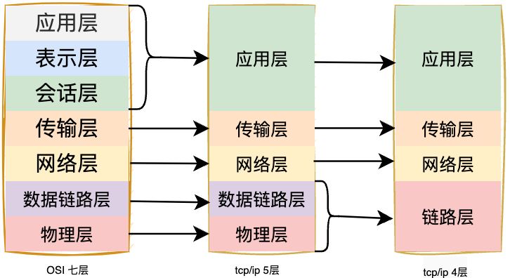
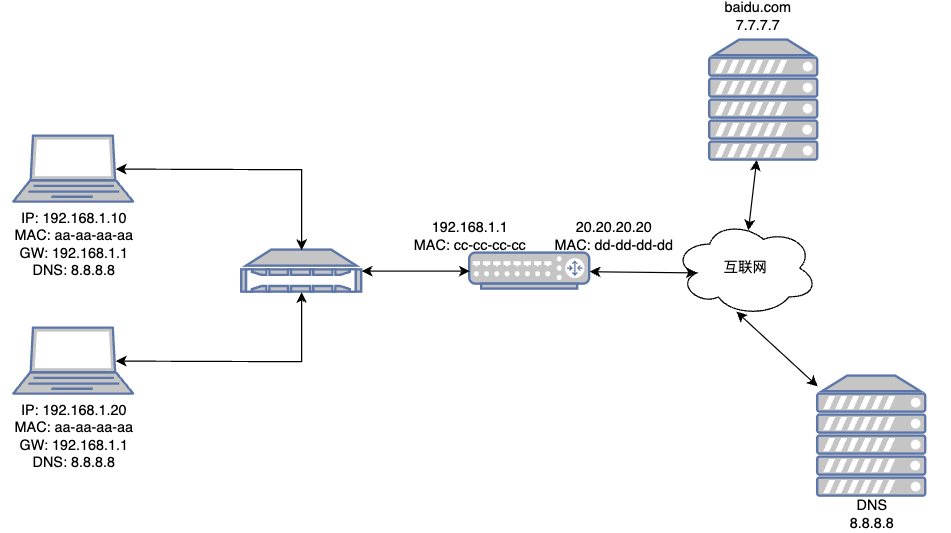
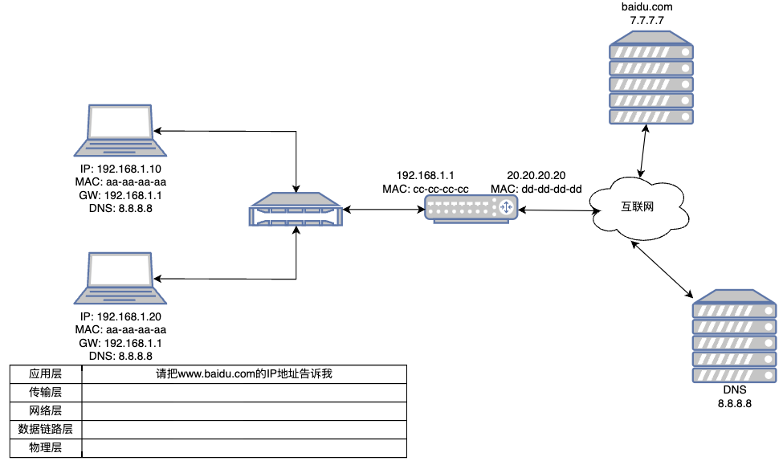
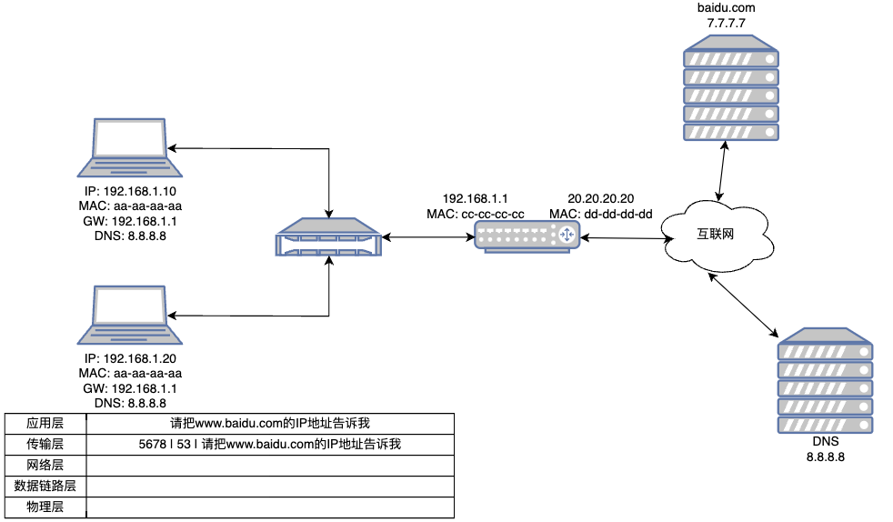
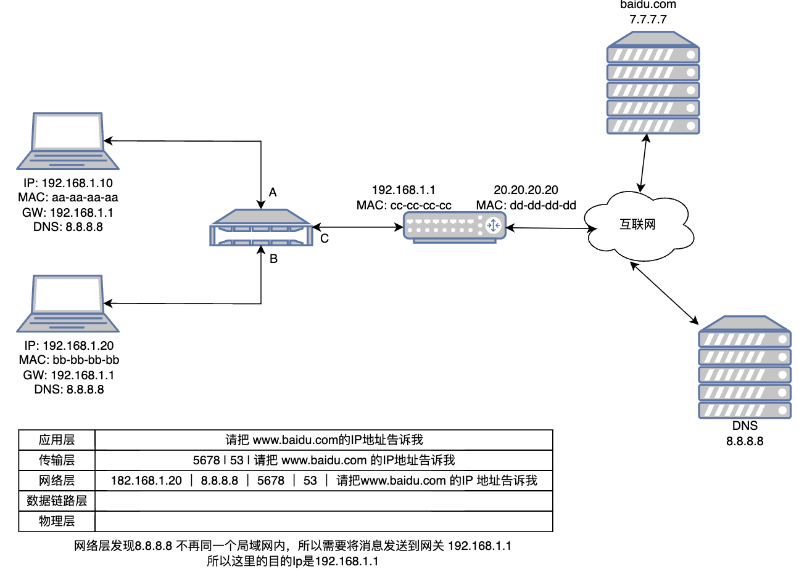
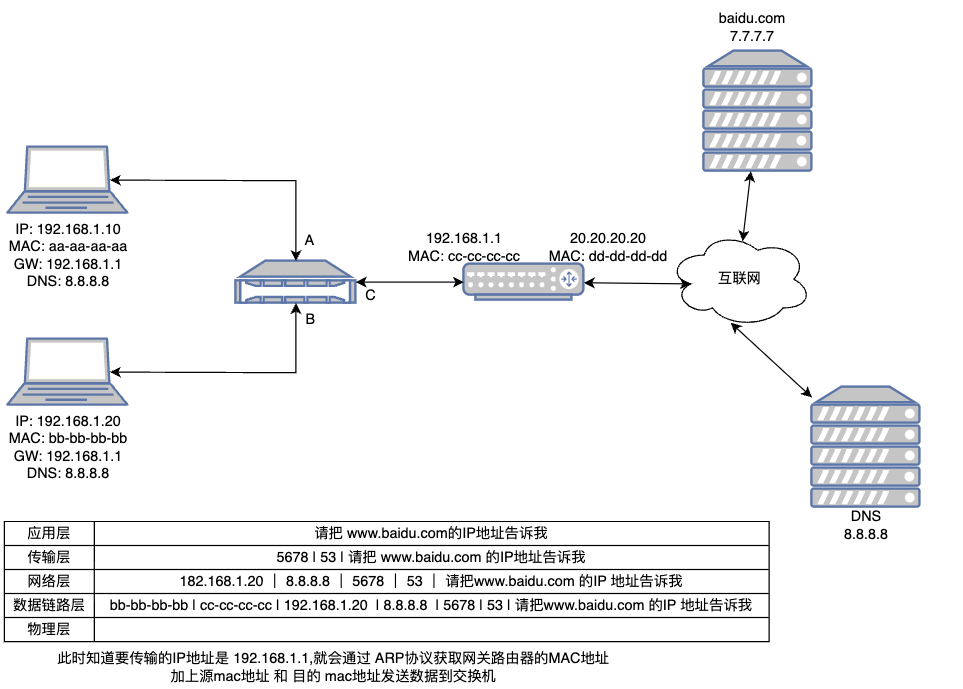
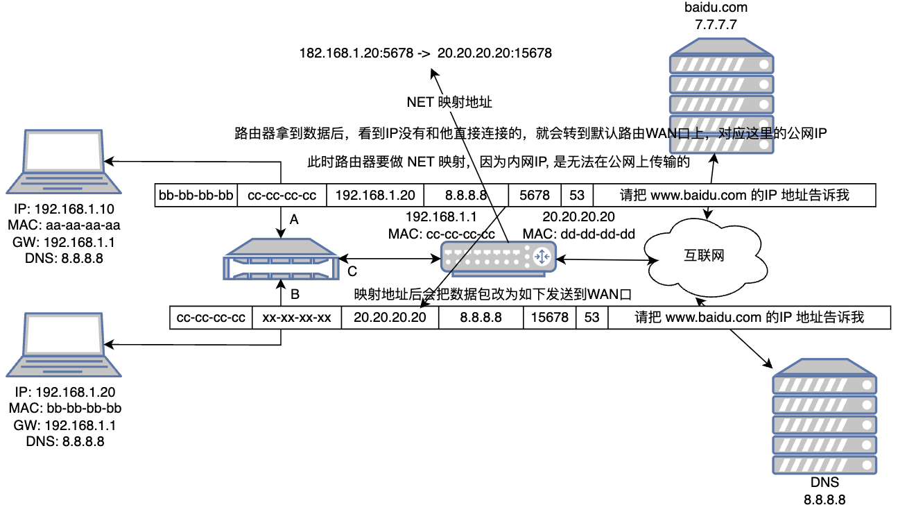

如何把请求发送出去的？这里我们就需要知道 OSI 七层模型，但是实际上我们使用的是TCP/IP 4层模型

## 网络模型

为了使得多种设备能通过网络相互通信，和为了解决各种不同设备在网络互联中的兼容性问题，国际标准化组织制定了开放式系统互联通信参考模型（*Open System Interconnection Reference Model*），也就是 OSI 网络模型，该模型主要有 7 层，分别是应用层、表示层、会话层、传输层、网络层、数据链路层以及物理层。

每一层负责的职能都不同，如下：

- 应用层，负责给应用程序提供统一的接口；
- 表示层，负责把数据转换成兼容另一个系统能识别的格式；
- 会话层，负责建立、管理和终止表示层实体之间的通信会话；
- 传输层，负责端到端的数据传输；
- 网络层，负责数据的路由、转发、分片；
- 数据链路层，负责数据的封帧和差错检测，以及 MAC 寻址；
- 物理层，负责在物理网络中传输数据帧；

由于 OSI 模型实在太复杂，提出的也只是概念理论上的分层，并没有提供具体的实现方案。

事实上，我们比较常见，也比较实用的是四层模型，即 TCP/IP 网络模型，Linux 系统正是按照这套网络模型来实现网络协议栈的。

TCP/IP 网络模型共有 4 层，分别是应用层、传输层、网络层和网络接口层，每一层负责的职能如下：

- 应用层，负责向用户提供一组应用程序，比如 HTTP、DNS、FTP 等;
- 传输层，负责端到端的通信，比如 TCP、UDP 等；
- 网络层，负责网络包的封装、分片、路由、转发，比如 IP、ICMP 等；
- 网络接口层，负责网络包在物理网络中的传输，比如网络包的封帧、 MAC 寻址、差错检测，以及通过网卡传输网络帧等；

TCP/IP 网络模型相比 OSI 网络模型简化了不少，也更加易记，它们之间的关系如下图：

## 在浏览器输入www.baidu.com 发生了什么

首先我们的网络是通过 IP 来定位的，域名并不具有定位功能只是方便记忆的一串字符串，域名它绑定了一个IP地址，我们如果想通过域名来访问一个网站的话，就必须要知道这个域名所对应的IP地址，那就需要去找 DNS服务器获取，但是他并不是一开始就会去找DNS服务器获取，而是先找浏览器缓存还有本地的缓存，看看之前有没有访问过 baidu.com, 如果没访问过baidu.com 的话，那么它将会找本地hosts文件的映射的关系，如果host文件中没有添加映射，那么它将会发送请求到DNS服务器，也就是你本地配置的DNS服务器的IP地址。

* 1、此时浏览器就会想发送一个消息到DNS服务器, 请把www.baidu.com IP 地址告诉我

* 2、应用层数据来到传输层，传输层就会将数据做一次 `端口` 的封装:  5678 | 53 | 请把www.baidu.com IP 地址告诉我

* 3、传输层数据来到网络层，网络层数据将数据做一次网络包( `ip` ) 的封装: 192.168.1.20｜ 8.8.8.8｜ 5678  ｜53 ｜ 请把www.baidu.com IP 地址告诉我

* 4、网络层数据来到数据链路层，在局域网内两个机器间进行通行使用的`mac地址`，会将数据再次封装 bb-bb-bb-bb | cc-cc-cc-cc | 192.168.1.10｜ 8.8.8.8｜ 5678  ｜53 ｜请把www.baidu.com IP 地址告诉我

* 5、数据到交换机后，交换机是一个三次网络设备，能够解析三层的数据，看到目的 IP 为 8.8.8.8，路由器一看没有和 8.8.8.8 连接的机器，路由器一般会设置一个默认路由，一般就是公网了，此时路由会通过 NET 转换，为什么要做这个NET转换，因为我们这个源IP地址是一个内网的网段无法在公网上传输，必须转换成WAN口对应的公网IP进行传输，那么它是整么映射的呢，路由器有一个NET映射表

通过 N 跳后，DNS 服务器获取到消息，回复给客户端百度的IP是 7.7.7.7

得到百度IP后，在使用相同的网络通信过程，访问百度
